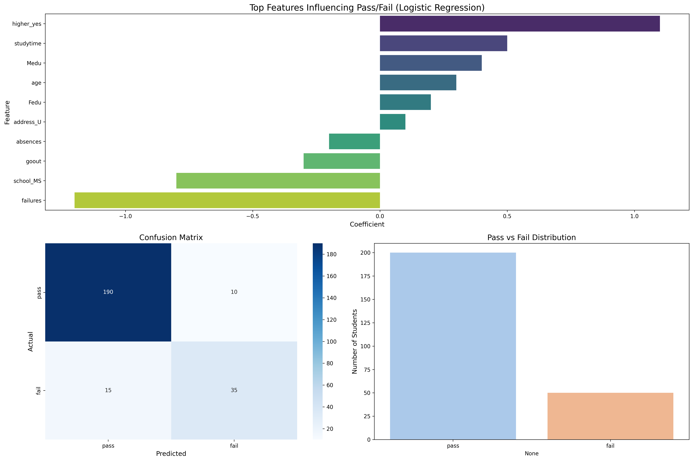

# Student Performance Analysis

This project analyzes student performance using a dataset of student attributes and grades. The goal is to understand which factors most influence whether a student passes or fails, and to visualize the results using clear charts.

## Features

- **Data Exploration:** Overview of the dataset, including student demographics and academic info.
- **Machine Learning Model:** Logistic Regression to predict student pass/fail outcomes.
- **Key Visualizations:**
  1. **Top Features Influencing Pass/Fail:** Logistic Regression coefficients showing which factors increase or decrease the likelihood of passing.
  2. **Confusion Matrix:** Model predictions vs actual outcomes to evaluate performance.
  3. **Pass vs Fail Distribution:** Shows the balance of pass/fail in the dataset.

## Project Files

| File | Description |
|------|-------------|
| `student_performance.py` | Python script for data analysis, logistic regression, and chart generation |
| `student_performance_charts.png` | High-resolution combined chart of all visualizations |
| `student-mat.csv` | Student performance dataset (math) |
| `student-por.csv` | Student performance dataset (Portuguese) |
| `student-merge.R` | Optional R code for merging datasets |
| `student.txt` | Notes or dataset info |

## Visualization



---

## How to Run

1. Clone this repository:

```bash
git clone https://github.com/shainajaneee/student-performance-analysis.git
